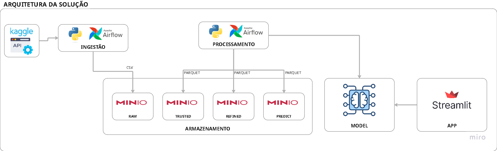

# PROJETO IA - CASE IEEE-CIS Fraud Detection (Vesta) 

## 📝 Descrição do Projeto
Este projeto tem caráter estritamente educacional e foi desenvolvido com o objetivo de colocar em prática os conhecimentos e modelos de *Machine Learning* estudados nas aulas da FIA. 

O foco principal deste repositório é demonstrar o ciclo de vida de dados aplicado ao aprendizado de máquina, abrangendo desde a análise exploratória até a estruturação de um *pipeline* de produção para o modelo.

> ⚠️ **Aviso Importante:** Por ser um ambiente de estudo e experimentação (*Proof of Concept*), os modelos e fluxos aqui apresentados não devem ser levados para um ambiente de produção real.

## 🎯 Objetivo de Negócio
* **Problema:** Muitas empresas perdem vendas legítimas por excesso de cautela ou ganham prejuízos por falta dela. Credenciais vazadas, dados roubados, engenharia social são exemplos de técnicas utilizadas por fraudadores diariamente.
O case apresentado da Vesta demonstra na prática o impacto das fraudes para o negócio, onde 3,5% das transações são fraudes, impactando em mais de 3 milhões de dólares em transações fraudulentas

  - Os desafios operacionais em identificar essas fraudes envolvem 
    - Assimetria nos dados
    - Trade-off da experiência
    - Falsos negativos
    - Mudanças nas táticas pelos fraudadores

* **Meta de Negócio:** Reduzir o volume de fraudes financeiras sem impactar negativamente a experiência do cliente legítimo. A solução proposta utiliza ML para apoiar a identificação de transações com maior probabilidade de fraude. O foco do modelo é aumentar a capacidade de capturar fraudes reais, reduzindo o número de fraudes que passam despercebidas.

## 🧪 Resumo da Metodologia Utilizada
1.  **Sanitização:** 
    | Categoria / Grupo | Tratativa Aplicada | Regra Técnica (Como o script faz) | Justificativa Analítica (Por que é feito) |
    | :--- | :--- | :--- | :--- |
    | **Ajustes Nulos (Categóricas)** | Criação de features missing | Identifica variáveis onde o nulo pode representar uma informação importante. | Fraudadores frequentemente tentam ocultar dados. |
    | **Extração de métricas temporais** | Criação de categorias temporais | Criação de categorias para períodos do dia e aplicação de redução de dimensionalidade. | Permite capturar padrões comportamentais ligados ao horário das transações. |
    | **Grupo C (Contagens)** | Agrupamento de variáveis 'C' | Agrupa as variáveis "C" sobre medidas estatísticas simples (máx, mín, média, contagem). | Variáveis de contagem brutas têm baixa correlação linear, mas suas combinações não-lineares (picos e somas) revelam anomalias de comportamento. |
    | **Grupo D (Tempo / Recência)** | Mapeamento de Contas Novas | Agrupa as variáveis "D" sobre medidas estatísticas simples (máx, mín, média, contagem). | Contas novas possuem forte correlação com fraudes. |
    | **Identidade** | Presença de Identidade | Cria uma categoria baseada na quantidade de dados de identidade existentes. | Avalia se o usuário forneceu uma "pegada" digital rastreável ou se a transação é completamente fantasma/anônima. |
    | **Grupo V (Vesta - Ocultas)** | Redução de Dimensionalidade | Foca apenas em uma lista fechada das Top 20 variáveis V (previamente definidas) e calcula a Soma e a Média delas. | O grupo V possui centenas de colunas. Ao invés de usar todas e causar ruído/lentidão, o script isola apenas os 20 melhores preditores. |
    | **Métricas Compostas** | Scores de Qualidade da Linha | Calcula o `completeness_score` (taxa de preenchimento) e `risk_flag_sum` (soma das flags de ausência de dados). | Cria um indicador unificado para o modelo entender o quão "esburacado" e suspeito está aquele registro de transação. |
    | **Limpeza Base / Filtros** | Corte de Variáveis Com pouco valor | Colunas com mais de 70% de dados nulos são descartadas, exceto a variável alvo (`isFraud`). | Evita que o modelo aprenda padrões sobre "nada" (ruído gerado por excesso de imputação). |
    | **Ajustes Nulos (Numéricos)** | Preenchimento Final | Variáveis Numéricas: Nulos são substituídos pela Mediana. | Garantia técnica de que a base não possui nenhum NaN (*Not a Number*). |
2.  **Modelagem:** 
    ## 🔬 Abordagem Metodológica
    * **Técnica Utilizada:** Classificação
    * **Modelos Avaliados:** Random Forest, XGBoost e LightGBM
    * **Métrica de Otimização:** $F_{\beta}$ Score (com multiplicador $\beta = 2$, dando um peso significativamente maior ao *Recall* do que à *Precisão*).
    * **Otimização de Hiperparâmetros:** Otimização Bayesiana utilizando o framework **Optuna**.

    ---

    ## 🛡️ Controle de Overfitting

    Para garantir a capacidade de generalização do modelo e evitar o sobreajuste, foram aplicadas as seguintes estratégias:

    1.  **Early Stopping (50):** Interrupção do treinamento caso os modelos não apresentem evolução dentro de 50 iterações consecutivas.
    2.  **Validação Cruzada Estratificada:** Divisão dos dados preservando o percentual de classes em cada split, ideal para cenários com dados desbalanceados.
    3.  **Auditoria de Diferenças:** Análise comparativa entre as métricas de teste e validação cruzada para identificar e sinalizar possíveis desvios de overfitting.

    ---

    ## 🏆 Modelo Selecionado

    O modelo que apresentou o melhor desempenho geral considerando os critérios estabelecidos foi o **XGBoost**.

    * **Métrica Principal de Avaliação:** F1-Score

    ### Hiperparâmetros Finais Ajustados
    ```python
    {
        'n_estimators': 782,
        'learning_rate': 0.2442,
        'subsample': 0.9579,
        'max_depth': 9
    }

4.  **Avaliação:**
# Desempenho do Modelo na Base de Teste

Abaixo estão os principais destaques de negócio obtidos na base de teste, seguidos pela tabela comparativa detalhando o comportamento das métricas de acordo com a variação do *Threshold* de Score (TS).

## 🎯 Destaques do Modelo (Configuração TS 57%)

* **Capacidade de Intercepção:** O modelo conseguiu identificar e interceptar **72%** de todas as fraudes na base de teste.
* **Assertividade dos Alertas:** Das transações que o modelo decide bloquear (alertando ser fraude), **85%** são realmente fraudulentas. Com isso, restam apenas **15%** de falsos positivos (alarmes falsos).

---

## 📊 Tabela Comparativa de Métricas

| Métrica | Resultado (Teste) - TS 50% | Resultado (Teste) - TS 57% |
| :--- | :---: | :---: |
| **Precisão** | 83,2% | 85,8% |
| **Recall (Sensibilidade)** | 74,1% | 72,6% |
| **F1-Score** | 78,4% | 78,6% |

# Estrutura do Repositório Git - Projeto Data Science

Este documento apresenta a estrutura de diretórios e arquivos obrigatória para o repositório Git do projeto, conforme os requisitos estabelecidos. Cada integrante do grupo deve manter seu próprio repositório individual com esta organização.

---

## 📂 Árvore de Diretórios

```text
├── app/* # Aplicação em streamlit ainda em desenvolvimento
├── Dados/
│   ├── database
│   ├── abt_metadata.json          # Arquivo de report (resultados de tratativas da ABT)
│   └── clean_data_report.json     # Arquivo de report (resultados de tratativas da tratamento da camada raw)
├── DataPipeline/
|   ├── util
|   |   ├── import_minio.py
|   ├── abt_transform.py
│   ├── data_sanitization.py
│   ├── exp_analysis.ipynb
│   ├── ingestion_data.py
│   └── pipeline_config.json       # Arquivo de configuração (variáveis, parâmetros e metadados)
├── MLOps/
│   ├── dags
|   |   ├── 1_raw_fraud_data_pipeline.py
|   |   ├── 2_trusted_fraud_data_pipeline.py
|   |   ├── 3_refined_fraud_data_pipeline.py
|   |   ├── 4_model_fraud_data_pipeline.py
│   ├── plugins
│   ├── docker-compose.yml         
│   └── Dockerfile.airflow
├── Model/
│   ├── evaluation.ipynb
│   ├── generate_scaler.py
│   ├── model_config.json          # Arquivo de configuração (hiperparâmetros e metadados)
│   ├── predict.py
│   ├── scaler_features.json       # Arquivo de report (formato da tabela final para pre processamento)
│   ├── train.py
│   └── training_metrics.json      # Arquivo de report (resultado de treinamento)
├── straming_pipeline/             # Ainda em desenvolvimento
│   ├── Dockerfile
│   └── requirements.txt
├── README.md                      # Documentação principal do projeto
├── requirements.txt
└── vars.json                      # Arquivo de configuração (para notebooks)

```

---

## 📝 Descrição Detalhada dos Componentes

### 1. `/app`
Diretório destinado para a aplicação do streamlit (ainda em desenvolvimento).

### 2. `/Dados`
Diretório destinado ao armazenamento das bases de dados raw e arquivos de report de tratamento.
* **`database\`**: Dado bruto original, sem nenhuma alteração ou tratamento prévio.
* **`abt_metadata.json`**: Report de metadados sobre tratativa ABT (valores se alteram na execucação da tabela de abt).
* **`clean_data_report.json`**: Report de metadados sobre tratativa de limpeza (valores se alteram na execucação da tabela de limpeza).

### 3. `/DataPipeline`
Contém os códigos responsáveis pela engenharia, tratamento e exploração dos dados.
* **`util/import_minio.py`**: Classe de conexão com o Minio (Leitura e Escrita).
* **`abt_transform.py`**: Script que realiza as transformações matemáticas, encodings, criações de features (*feature engineering*) e consolida os dados limpos no formato final da ABT e salva os dados no Minio.
* **`data_sanitization.py`**: Script em Python focado na limpeza, tratamento de valores nulos, duplicados, remoção de outliers e padronização dos dados brutos , salvando resultados no Minio.
* **`ingestion_data.py`**: Script em Python responsavel pela conexão com API do Kaggle, download dos dados e importação no Minio. 
* **`exp_analysis.ipynb`**: Notebook Jupyter contendo a Análise Exploratória de Dados (EDA) realizada sobre os dados limpos, incluindo visualizações gráficas, correlações e estatísticas descritivas. (Necessita refinamento pois ao configurar o ambiente com o Minio os dados não são salvos localmente)
* **`pipeline_config.json`**: Centraliza variáveis globais do pipeline (ex: caminhos de arquivos, tipos de dados, colunas obrigatórias).

### 4. `/Mlops`
Contém os códigos de execução do ambiente no Docker (docker-compose) e configuração de dags do Airflow.
* **`dags/1_raw_fraud_data_pipeline.py`**: Dag Responsavel pelo acesso , download e disponibilização dos dados raw no Minio. (A dag possui Sensor no airflow , respeitando as dependencias)
* **`dags/2_trusted_fraud_data_pipeline.py`**: Dag Responsavel pela camada de limpeza dos dados e disponibilização dos dados no minio. (A dag possui Sensor no airflow , respeitando as dependencias)
* **`dags/3_refined_fraud_data_pipeline.py`**: Dag Responsavel pela execução do modelo ABT e disponibilização dos dados no minio. (A dag possui Sensor no airflow , respeitando as dependencias)
* **`dags/4_model_fraud_data_pipeline.py`**: Dag Responsavel por criação do pkl do modelo e pre processador e geração da base de predict. (A dag possui Sensor no airflow , respeitando as dependencias)

* **`docker-compose.yml`**: Arquivo para subida do ambiente no Docker.
* **`Dockerfile.airflow`**: Docker File do ambiente airflow.

### 5. `/Model`
Concentra os artefatos relacionados à modelagem preditiva, treinamento e métricas de performance.
* **`evaluation.ipynb`**: Notebook voltado para a avaliação detalhada do modelo utilizando métricas adequadas (Matriz de Confusão, Curva ROC-AUC, Precision-Recall, F1-Score) e análise de interpretabilidade (ex: SHAP, Feature Importance) (Necessita refinamento pois ao configurar o ambiente com o Minio os dados não são salvos localmente).
* **`generate_scaler.py`**: Script responsável pela geração do pkl do pré processador.
* **`model_config.json`**: Arquivo de configuração do modelo de treinamento.
* **`predict.py`**: Script responsável pela predição (utilizando os pkl disponiveis).
* **`scaler_features.json`**: Arquivo report sobre features (ordem e variaveis)
* **`train.py`**: Script responsável pelo treinamento dos modelos, seleção do melhor modelo, métricas de validação cruzada e geração do pkl final do modelo
* **`training_metrics.json`**: Arquivo report sobre métricas de treinamento.

### 6. `/straming_pipeline`
Concentra arquivos de subida do ambiente Streamlit e requisitos de bibliotecas necessarias para o projeto (requerements.txt) .
* **`Dockerfile`**: Docker File do ambiente Streamlit. (Em desenvolvimento)
* **`requirements.txt`**: Listagem com todas as dependências do projeto e suas respectivas versões.

### 7. Raiz do Repositório
* **`requirements.txt`**: Listagem com todas as bibliotecas necessarias para execução dos notebooks do projeto.
* **`Readme.md`**: Guia principal de leitura e apresentação do projeto.

## 📝 Arquitetura da Solução



O fluxo desenvolve-se através de 4 camadas principais, onde a qualidade da informação é progressivamente refinada:

### 📥 1. Ingestão (Camada Raw)
* **O Processo:** O fluxo inicia com scripts em **Python**, orquestrados de forma automatizada pelo **Apache Airflow**, que fazem a extração direta dos dados através da API do **Kaggle**.
* **Armazenamento:** Os ficheiros originais são armazenados no **MinIO** na camada **RAW**, guardados no formato **CSV**.
* **O Racional:** O foco aqui é ter uma réplica exata e crua da fonte. O formato CSV facilita a validação visual inicial e garante que temos um ponto de restauro caso seja necessário reprocessar o histórico.

### ⚙️ 2. Processamento (Camadas Trusted, Refined e Predict)
* **O Processo:** O fluxo continua no **Apache Airflow**, novos processos em **Python** recolhem os dados brutos e aplicam as devidas transformações, limpezas e agregações.
* **Armazenamento Multi-Camada:**
  * **TRUSTED:** Dados limpos, tipados e sem inconsistências. Guardados no MinIO em formato **Parquet**.
  * **REFINED:** Dados enriquecidos com regras de negócio, prontos para consumo analítico. Também em formato **Parquet**.
  * **PREDICT:** Uma camada dedicada a armazenar os resultados e as *features* geradas pelos modelos preditivos, em **Parquet**.
* **O Racional:** A escolha do formato Parquet nestas etapas otimiza drasticamente o armazenamento (compressão colunar) e a velocidade de leitura para o modelo e para a aplicação.

### 🤖 3. Modelação (Model)
* **O Processo:** Um modelo de Machine Learning consome os dados altamente refinados para treinar e gerar inferências. Esta componente é o "cérebro" da operação, transformando dados processados em inteligência acionável.

### 🖥️ 4. Consumo (Streamlit App)
* **A Aplicação:** O ponto de contacto final com o utilizador é uma interface web interativa desenvolvida inteiramente em **Streamlit**.
* **O Racional:** O Streamlit permite construir painéis dinâmicos e intuitivos de forma ágil com Python, ligando-se perfeitamente aos resultados gerados pelo modelo mesmo sendo apenas uma demontrasção, entregando a informação de forma visual.

## 🛠️ Stack Tecnológica

As opções tecnológicas visam garantir controle, performance e facilidade de manutenção:

* 📊 **Kaggle API:** A fonte primária de dados, permitindo acesso programático a *datasets* ricos.
* 🐍 **Python:** A linguagem central que une todo o projeto, utilizada desde a ingestão à modelação e criação da interface web.
* ⏳ **Apache Airflow:** O orquestrador oficial do fluxo, responsável por agendar, monitorizar e gerir as dependências entre a ingestão e o processamento.
* 🪣 **MinIO:** O nosso Data Lake *on-premise*/escalável. Organiza os dados em quatro zonas distintas: Raw, Trusted, Refined e Predict.
* 👑 **Streamlit:** A *framework* escolhida para criar o produto final de dados. Transforma <i>scripts</i> complexos numa aplicação web de fácil utilização.

## ⚙️ Instruções de Como Treinar o Modelo

### Pré-requisitos
Ambiente Docker
 - Docker
 - Git
Ambiente local
 - python (Atenção: Para execução dos notebooks , necessita versão python 3.11)
 - Git


### 1. Clonar o Repositório
```bash
git clone <url-do-seu-repositorio>
```
### 2. Credenciais da Kaggle
Para funcionamento do projeto é necessário configurar variavel de ambiente com as credenciais da API TOKEN do Kaggle (para mais informações de como gerar a API TOKEN basta ir na documentação do Kaggle [Link](https://www.kaggle.com/settings/api))
Abra o Prompt de Comando (cmd) ou PowerShell na raiz do projeto , execute o comando abaixo.
```bash
echo KAGGLE_API_TOKEN=SUA_API_KEY > MLOps\.env
```
### 3. Docker

### 3.1 Subida do ambiente no Docker
Para subir o ambiente , abra o Prompt de Comando (cmd) ou PowerShell na raiz do projeto , execute o comando abaixo.
```bash
docker compose -f MLOps\docker-compose.yml up -d 
```

### 3.2. Execução do pipeline de dados
Obs: As bases do Keaggle são massivas e exigem recursos para processamento, como o projeto trata-se de uma demonstração as bases trusted, refined e construção do modelo foram baseados sobre 40 mil registros de transações, caso queira utilizar a base completa basta altera a configuração no arquivo `DataPipeline\pipeline_config.json` ("activate" : false) na propriedade de "limitation"

```json
"limitation": {
    "activate": true,
    "chunk_size": 500,
    "chunk_count": 3
  },
```

Acesse o ambiente do airflow local no link `http://localhost:8080/home`
Por padrão as dags começar pausadas
Devido a isso ative todas as dags, (**importante** As dags possui um sensor de dependencia que funciona muito bem pelo scheduler programado, porém execuções manuais o sensor perde a referencia de execução, sendo necessario marcar as task de sensores como sucesso e seguindo a ordem de execução)
```bash
1_raw_fraud_data_pipeline > 2_trusted_fraud_data_pipeline > 3_refined_fraud_data_pipeline > 4_model_fraud_data_pipeline
```

 - O modelo treinado e seus respectivos metadados serão salvos conforme configurado em `Model/model_config.json` e os resultados `Model/training_metrics.json`.
 - Os Arquivos `Model/fraud_model.pkl` e `Model/scaler.pkl` serão criados.
 - As predições serão salvas no Minio
 - A aplicação streamlit estará disponivel no link (http://localhost:8501/)